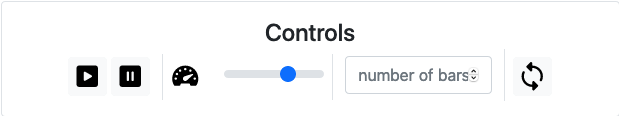

# Sorting Visualizations

This is a sorting visualization of five of the most popular sorting algorithms:

- Bubble Sort
- Heapsort
- Insertion sort
- Merge sort and
- Quicksort

## Demo

You can see a [**Demo here**](https://throvn.github.io/sorting-visualizations/)

### Example: Quicksort

## Usage

1. Play / Resume
2. Pause
3. Speed
4. Length of (random generated) array to sort
5. Repeat with different values (but same number of elements)

> You can also hover over the elements and a description will be shown

## Experiencing Problems?

If you experience any issues or miss a sorting algorithm or other functionality feel free to open an issue [here](https://github.com/Throvn/sorting-visualizations/issues).

## ToDo's

- [ ] Add more sorting algorithms
- [ ] Add explaination (blog post like) to the algorithms (like on bubble sort)
- [ ] Refactor code to typescript
- [x] Darkmode - Based on system settings
- [ ] (Bubblesort) Highlight changed elements
- [ ] Add documentation to the rest of the algorithms (for a reference now check the `bubblesort/main.js` file.) - Repetitive
- [ ] (Maybe) Add all algorithms in one file

## Want to contribute?

Every help is welcome!
Feel free to contact me any time :P
